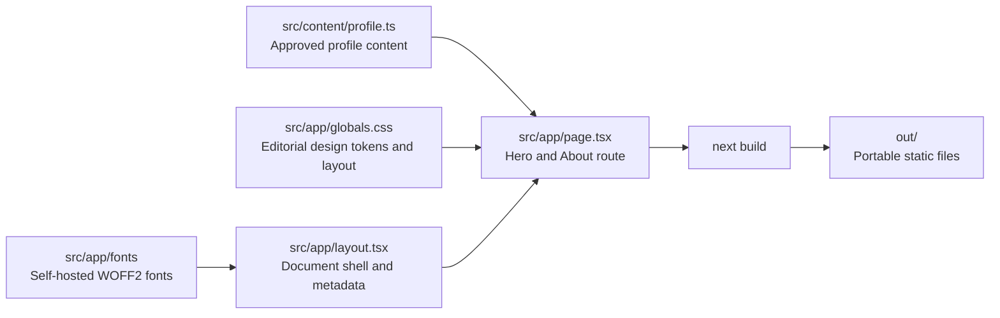

# System Documentation

## Purpose

This repository hosts Jayven Lupera's professional website. It is a content-light,
single-route site designed to be fast, maintainable, and suitable for a public profile.

## Runtime Architecture



The system has no server, database, API routes, authentication, or runtime data source.
`next.config.ts` sets `output: "export"`, so a production build produces plain static
files in `out/` for deployment on Cloudflare Pages or another static host.

## Key Modules

| Location | Responsibility |
| --- | --- |
| `src/content/profile.ts` | Typed, approved public profile content. This is the sole source for user-provided copy. |
| `src/app/page.tsx` | The `/` route. Renders Hero and About from `profile`; it does not duplicate profile copy. |
| `src/app/layout.tsx` | Loads local Newsreader and IBM Plex Mono assets and supplies document metadata. |
| `src/app/globals.css` | Defines the editorial palette, grid, type hierarchy, responsive layout, and reduced-motion behavior. |
| `next.config.ts` | Configures static export and disables unavailable image optimization. |
| `tests/` | Exercises the approved content seam and generated static-output seam. |

## Content and Confidentiality

All public biographical data belongs in `src/content/profile.ts`. The `currentRole`
description is optional by design.

When adding copy:

1. Update the typed content module.
2. Render it from the relevant section without duplicating literal profile copy.
3. Extend the content seam test with an independent approved value where warranted.

## Design System

The UI uses warm paper (`#f4f0e8`), near-black ink (`#171714`), muted metadata, fine
rules, a strict three-column desktop grid, and generous whitespace. Newsreader is the
display face; IBM Plex Mono is reserved for metadata. On small screens, the grid becomes
one column. Scroll behavior is disabled for visitors who prefer reduced motion.

## Verification Boundaries

Two public seams protect the current site:

| Command | Boundary checked |
| --- | --- |
| `npm run test:content` | The typed `profile` module contains approved identity, role, focus, and contact data; the optional Optum description is absent. |
| `npm run build` | The Next.js app produces a static export in `out/`. |
| `npm run test:build` | `out/index.html` contains the visitor-facing identity, role, tagline, and bio. Run after `npm run build`. |
| `npm run lint` | ESLint checks the application source. |

Node's built-in test runner executes the tests. The TypeScript content test uses Node's
type-stripping support; `allowImportingTsExtensions` is enabled in `tsconfig.json` for
that no-emit workflow.

## Delivery Workflow

```bash
npm install
npm run test:content
npm run build
npm run test:build
npm run lint
```

Deploy the generated `out/` directory to a static host. The intended production host is
Cloudflare Pages, configured to run `next build` and publish `out`.

## Roadmap

- Add accessible persisted light/dark theme behavior.
- Publish Experience, Skills, Contact, and Footer sections from the content module.
- Add release metadata, Open Graph image, favicon, `robots.txt`, sitemap, and deployment
  documentation.

The tracked requirements and issue states are maintained under `.scratch/`, which is
local planning material and intentionally ignored by Git.
